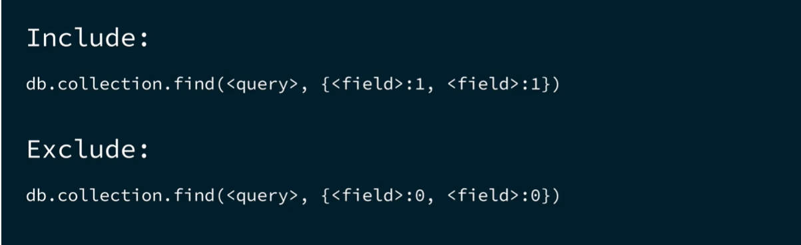

                                            {{MONGO DB || NOTES}}

1). Databases >>>> Collections (Tables) >>>> Documents(Rows).

2). MongoDB reads data in JSON format but stores data in the BSON format (Binary JSON) and the maximum size of any document is  approximately 16 MB. More secure than the original Json format and have mor datatypes than Json.

3). Data that is accessed together should be stored together.

4). Refrencing (linking) and Embedding.

5). Refrencing saves the _id field of one document to another document.
    - No Duplication , smaller documents  , ❌ bigger query as we need to join multiple documents.

6). Embedding means storing subdocuments into documents.
   - Ideal for storing one-to-one or one-to-many documents together in a document.

*Note :* this can lead to unbounded documents , they may even exceed the size of the BSON document.

7). CRUD Operations :- 
    - *Inserting a new document* - db.collection.insertOne({}) method is used to insert a new document.
    - *Inserting various document* - db.collection.insertMany([{},{},....{}]) method is used to insert various documents at once.

    - *Find all documents* - db.collection.find() method is used to view all the documents at once.
**Note:** - $eq is same as the method metioned below.
    - *Find a single document* - db.collection.findOne({_id : ObjectId("5c8eccc1caa187d17ca6ed16")}) method is used to view a single document .
    - *Find various documents with a condtion* - db.collection.find({"city":"Jaipur"}) method is used to view all the documents witht the specified condition.
    - *Find various documents with various condtion* - db.collection.find({city: {$in : ["jaipur","kota"]} }) method is used to view all the documents witht the specified condition.

    - Finding Documents with 4 other conditions , $lt , $gt , $lte and $gte.
-
    -db.collection.find({ "customer.age" : {$lte : 65} }) --> Shows all customers with age <= 65
    -db.collection.find({ "customer.age" : {$gte : 65} }) --> Shows all customers with age >= 65
    -db.collection.find({ "customer.age" : {$lt : 65} }) --> Shows all customers with age < 65
    -db.collection.find({ "customer.age" : {$gt : 65} }) --> Shows all customers with age > 65
    - *$elemMAtch* operators can be used to find a subdocument that matches specific criteria in an array.
    - we can also use logical operators like $or and $and :
    -db.routes.find({ "airline.name": "Southwest Airlines", stops: { $gte: 1 } })
    -   db.routes.find({
        $or: [{ dst_airport: "SEA" }, { src_airport: "SEA" }],
        })
    -   db.routes.find({
        $and: [{ dst_airport: "SEA" }, { src_airport: "SEA" }],
        })

- **Replace, Update and Delete Documents** :
    -  **REPLACE**
    - Replace , replaces the existing documents (it can add a new row also, in the exisitng document.)
    - db.collections.replaceOne(filter,replacement,options).
    - filter is used to find a particular document , mostly by _id field.
    - db.books.replaceOne(
        {
            _id: ObjectId("6282afeb441a74a98dbbec4e"),
         },
        {
            title: "Data Science Fundamentals for Python and MongoDB",
            isbn: "1484235967",
            publishedDate: new Date("2018-5-10"),
            thumbnailUrl:
            "https://m.media-amazon.com/images/I/71opmUBc2wL._AC_UY218_.jpg",
            authors: ["David Paper"],
            categories: ["Data Science"],
        })

    - **UPDATE**
    - update, updates the existing documents (cant add new rows to the existing document.)

    - *Difference between the updateOne and replaceOne methods*
    - Since replaceOne() replaces the entire document - fields in the old document not contained in the new will be lost. With updateOne() new fields can be added without losing the fields in the old document.

    - to update the existing values of the document, we need to use the $set :{} operator.
    - to add a new value to the existing document, we need to use the $push :{} operator.
    - db.podcasts.updateOne(
        { _id: ObjectId("5e8f8f8f8f8f8f8f8f8f8f8") },
        { *$push*: { hosts: "Nic Raboy" } })

    - db.podcasts.updateOne(
        { title: "The Developer Hub" },
        { *$set*: { topics: ["databases", "MongoDB"] } },
        { upsert: true }) ======================================================= The upsert option creates a new document if no documents match the filtered criteria. 
        *$inc* - increments the given value.

-   - **findAndModify**
    - first updates/modifies the document and then finds and return that document that matchhes the query.
    - db.collection.findAndModify(filter, update, new)
    - db.podcasts.findAndModify({
        query: { _id: ObjectId("6261a92dfee1ff300dc80bf1") },
        update: { $inc: { subscribers: 1 } },
        new: true,    ================================================================= When the new option is set to true, the updated version of a document is returned, regardless of whether that document is new or existing.
    })

-   **updateMany()**
    - updates various documents at once, requires 3 params: 
    - db.collection.updateMany(filter,update,new)
    - db.authors.updateMany({age:{$lte: "1998"}},{$set:{inStock: true}})

-   **deleteOne() && deleteMany()**
    -first find that document using the id of the document then use deleteOne() or deleteMany() to delete the entire document.
    -db.podcasts.deleteOne({ _id: Objectid("6282c9862acb966e76bbf20a")})
    -db.podcasts.deleteMany({category: “crime”})

- **Sort() && limit()**
    - cursor.sort() and cursor.limit() (limit only takes number as input.)
    - db.companies.find({ category_code: "music" }).sort({ name: 1 }); ==> sorts name in ascending order. (it will show all the properties of the document.)
    - db.companies.find({ category_code: "music"}, {name:1}).sort({ name: 1 }); ==> sorts name in ascending order. (it will show only the projceted properties of the document.)

    - db.companies.find({ category_code: "music" }).sort({ number_of_employees: -1, _id: 1 }).limit(3);  ==> Sorts and limits the number of employees to top 3 only.

- **Projections**
    - db.collections.find(<query>,<projection>)
    -
    - db.inspections.find({ sector: "Restaurant - 818" },{ business_name: 1, result: 1 })
    - db.inspections.find({ sector: "Restaurant - 818" },{ business_name: 1, result: 1, _id: 0 })

- **countDocuments()**
    - db.collections.countDocuments(<query>,<options>)
    - db.trips.countDocuments({})   ==> will give all the documents inside of this collection.
    - db.trips.countDocumentqs({ tripduration: { $gt: 120 }, usertype: "Subscriber" }) ==> will give the count of "tripDuration" > 120 and "usertype": "Subscriber".

- **MongoDB Aggregation**
  - *Aggregation*: - an analysis and summary of the data.
  - *Stage*: - an aggregation operation performed on the data.
  - *Aggregation Pipeline*: - a series of stages completed one at a time in order.

**Note**:
  - documents that are output of the first stage are input into the next stage. 
  - These are the types of stages - $match , $group , $sort , $limit , $project , $count , $set and $out.

  1). **$match** -
    - its just like the mongoDb find() method. 
    - The $match stage filters for documents that match specified conditions. Here's the code for $match:
    - {
        $match: {"field_name": "value"}
      }

  2). **$group** -
    - it groups various documents together. 
    - {
      $group:
        {
          _id: <expression>, // Group key (this is the syntax , without group key , it wont work.)
          <field>: { <accumulator> : <expression> }
        }
      }
    - *Example*:-
    db.zips.aggregate([
          {   
            $match: { 
                state: "CA"
              }
          },
          {
            $group: {
                _id: "$city",
                totalZips: { $count : { } }
            }
          }
    ])

  3). **$sort** -
    - sorts the values in ascending (1) or descending order (-1).
    - {
        $sort: {
            "field_name": 1
        }
      }

  4). **$limit** -
    - limits the number of documents , takes a number as an input.
    - {
        $limit: 5
      }

    -*Example*:
    - db.zips.aggregate([
        {
          $sort: {
            pop: -1
          }
        },
        {
          $limit:  5
        }
    ])

  5). **$project** - (inclusions/exclusions)
  - same as field projections as in find() method.
  -  1 means that the field should be included, and 0 means that the field should be supressed.
  - {
    $project: {
        state:1, 
        zip:1,
        population:"$pop",
        _id:0
    }
}

  6). **$Set** 
  - adds a new document to the collection.
  - The $set stage creates new fields or changes the value of existing fields, and then outputs the documents with the new fields.
  - {
    $set: {
        place: {
            $concat:["$city",",","$state"]
        },
        pop:10000
     }
  }

  7). **$count** 
  - counts and returns the number of documents in a collection.
  - {
      $count: "total_zips"
    }

  8). **$out** 
  - used to add a new collection to the db.
  - {
      $count: "total_zips"
    }

**MongoDB Indexes**
- type of data structure in MongoDB.
- improves query performance , reduce disk i/o, reduce resource usage.
- types of indexes - 
- *single field* (single index only) ,
- *compound* (Multiple indexes , An index that contains references to multiple fields within a document) and 
- *multi-key indexes* (indexes on an array field)

- *Create a Single Field Index*
- db.customers.createIndex({
    email: 1
  },
  {
    unique:true
  })

- *View the Indexes used in a Collection*
- db.customers.getIndexes()

- *Hide the Indexes used in a Collection*
- db.customers.hideIndexes()

- *Delets the Indexes used in a Collection*
- Deleting an index can affect the query performance.
- db.collection.dropindex() , deletes one index from the collection.
- db.collection.dropindexes() , deletes all index from the collection.
- db.customers.dropIndex({
  active:1,
  birthdate:-1, 
  name:1
})

========================================================================================================================================================================\
<!-- 
**Creating MongoDB Transactions in Node.js Applications**
Review the following code, which demonstrates how to create multi-document transactions in MongoDB with Node.js.

Creating a Transaction
In this section, we'll go through the code to create a transaction step by step. We start the transaction by using the session’s withTransaction() method. We then define the sequence of operations to perform inside the transactions, passing the session object to each operation in the transactions.

Create variables used in the transaction.
// Collections
const accounts = client.db("bank").collection("accounts")
const transfers = client.db("bank").collection("transfers")

// Account information
let account_id_sender = "MDB574189300"
let account_id_receiver = "MDB343652528"
let transaction_amount = 100

Start a new session.
const session = client.startSession()

Begin a transaction with the WithTransaction() method on the session.
const transactionResults = await session.withTransaction(async () => {
  // Operations will go here
})

Update the balance field of the sender’s account by decrementing the transaction_amount from the balance field.
const senderUpdate = await accounts.updateOne(
  { account_id: account_id_sender },
  { $inc: { balance: -transaction_amount } },
  { session }
)

Update the balance field of the receiver’s account by incrementing the transaction_amount to the balance field.
const receiverUpdate = await accounts.updateOne(
  { account_id: account_id_receiver },
  { $inc: { balance: transaction_amount } },
  { session }
)

Create a transfer document and insert it into the transfers collection.
const transfer = {
  transfer_id: "TR21872187",
  amount: 100,
  from_account: account_id_sender,
  to_account: account_id_receiver,
}

const insertTransferResults = await transfers.insertOne(transfer, { session })

Update the transfers_complete array of the sender’s account by adding the transfer_id to the array.
const updateSenderTransferResults = await accounts.updateOne(
  { account_id: account_id_sender },
  { $push: { transfers_complete: transfer.transfer_id } },
  { session }
)

Update the transfers_complete array of the receiver’s account by adding the transfer_id to the array.
const updateReceiverTransferResults = await accounts.updateOne(
  { account_id: account_id_receiver },
  { $push: { transfers_complete: transfer.transfer_id } },
  { session }
)

Log a message regarding the success or failure of the transaction.
if (transactionResults) {
  console.log("Transaction completed successfully.")
} else {
  console.log("Transaction failed.")
}

Catch any errors and close the session.
} catch (err) {
  console.error(`Transaction aborted: ${err}`)
  process.exit(1)
} finally {
  await session.endSession()
  await client.close()
} -->